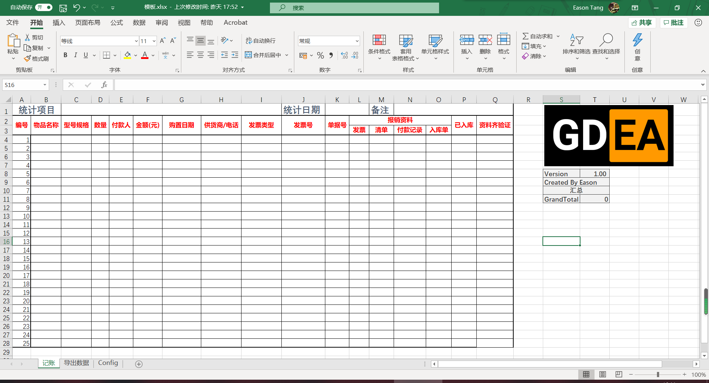
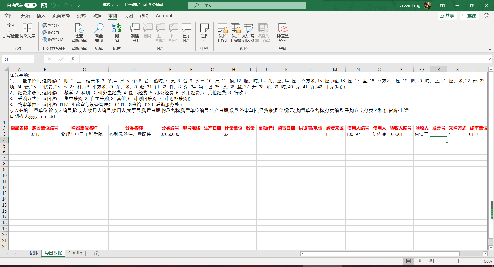

# GZHU_Expense_Reimburesement_Form

## 记账页

物品名称至单据号自行填写，报销资料选是/否，资料齐全后资料齐验证会自动出现是，请不要自己修改。

## 导出数据

导出数据部分会根据记账页数据自动填充，除一些固定数据如“经费来源”等不用做特别修改。

## Config页

记录了特别数据的配置。

## 导出

将导出页数据全部覆盖到clmb.xlsx文件中上传OA选择消耗类物资Excel导入即可。

## Credit

Credit to myself & GDEA.